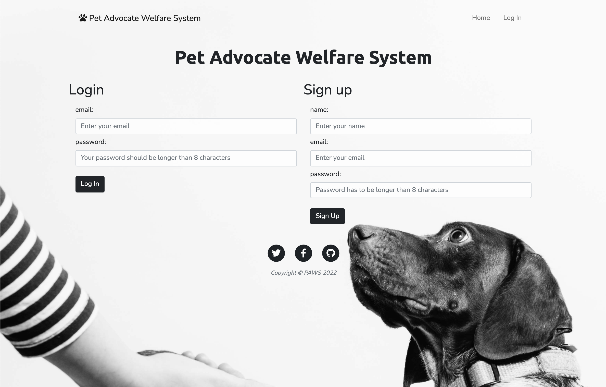
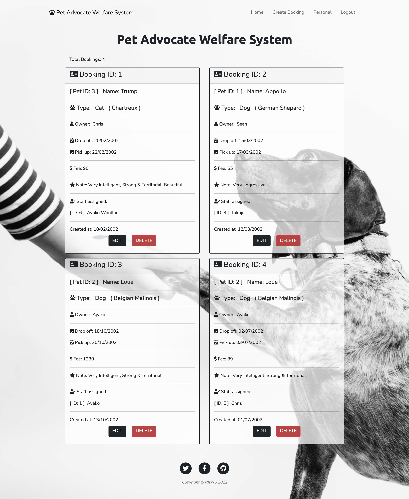
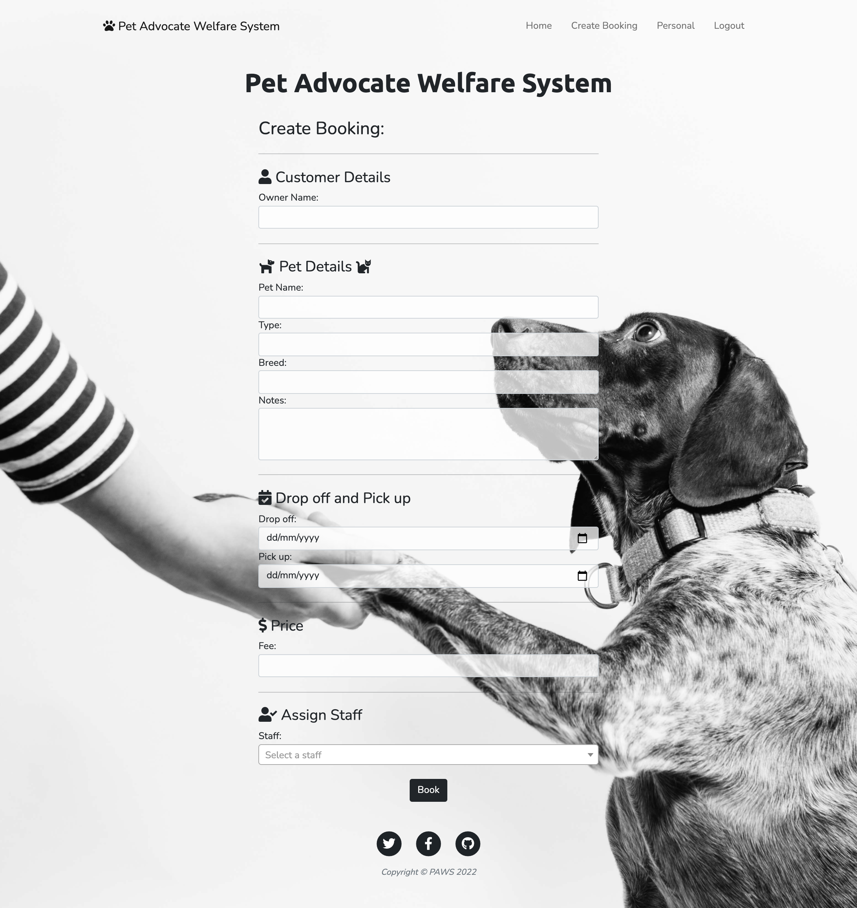
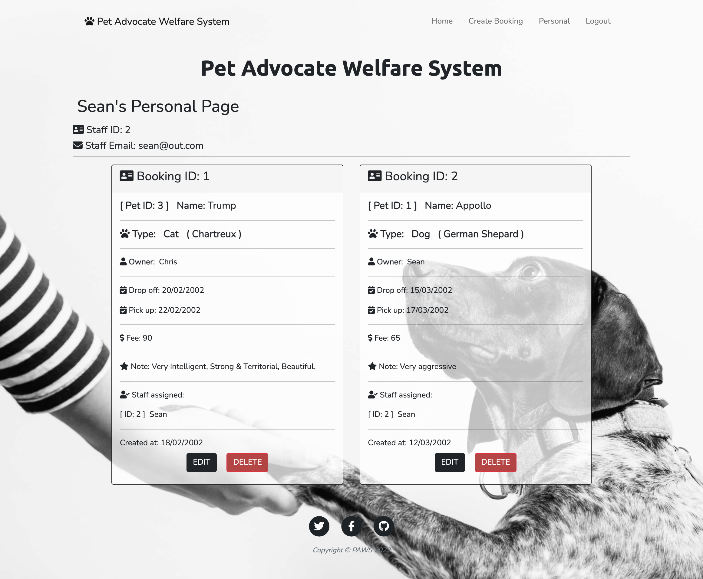

[](https://opensource.org/licenses/MIT)

---
  
# Pet-Advocate-Welfare-System 
<details>
  
<summary>Table of Contents</summary>

  
<ol>
  
<li>
  
<a href="#about-the-project">About The Project</a></li>

  
<ul>
  
<li><a href="#built-with">Built With</a></li>

<li><a href="#installation">Installation</a></li>

<li><a href="#license">License</a></li>
  
<li><a href="#contact">Contact</a></li>

<ul>
  
</ol>
  
</details>

 ## About The Project
 

In this project, we aim to create a Pet Registry for different types of animals. As the aim is to have a simple and efficient system to record and display vital information about pets who are staying as well as new customers. Having a one-stop to see all the necessary information about the business. 
 
 [Click Here to View Our Deployed Page](https://pet-advocate-welfare-system.herokuapp.com/)

 ## Home where you can see all bookings
 
 ## Create New Booking 
 
 ## Personal Page
 
 ## Update Page
 


<p align = "right">(<a href="#top">back to top</a>)</>

* 
* 
* 
* 
* 
* 
* [dotenv](https://www.npmjs.com/package/dotenv) 
* [body-parser](https://https://www.npmjs.com/package/body-parser)
* [nodemailer](https://https://www.npmjs.com/package/nodemailer)
* [bcrypt](https://www.npmjs.com/package/bcrypt)
* [express-session](https://www.npmjs.com/package/express-session)
* [connect-session-sequelize](https://www.npmjs.com/package/connect-session-sequelize)
  

<p align = "right"> (<a href="#top">back to top</a>)</>

## Getting Started

To get a local copy up and running follow these simple example steps.

## Installation

 1: The application will be invoked by using the following command:

 ```
  git clone git@github.com:Black-Mandarin/Pet-Advocate-Welfare-System-PAWS-.git
 ```

 2: Make sure that .env file has your DB password
 ```
 Please do not forget to write followings in .env file 
 (change the filename from .env.template to .env) 

 DB_NAME=blog_db
 DB_PASSWORD=
 DB_USER=root
 DB_SECRET=
 DB_EMAIL=
 DB_EMAIL_PASSWORD=
 ```

 3: Install npm packages
 ```
 npm i
 ``` 

 4: Run mysql and source db.schema.sql by using the following commands:
  ```
  mysql -u root -p
  ```
   (enter your mysql password)
  ```
  source db/schema.sql;
  ```

 5: Run seed files

 ```
 npm run seed
 ```

 6: Run to start the application
 ```
 npm start 
 ```

<p align="right">(<a href="#top">back to top</a>)</>

## License

[](https://opensource.org/licenses/MIT)

Distributed under MIT License.

See LICENSE.txt for more information.

<p align ="right">(<a href="#top">back to top</a>)</>

 ## Contact Us

PAWS Team: 
* [Sean Scott](https://github.com/seanscott95)
* [Ayako Woollan](https://github.com/ayacomputer)
* [Alan Cherian](https://github.com/Black-Mandarin)


Project Link: [https://github.com/Black-Mandarin/Pet-Advocate-Welfare-System-PAWS-](https://github.com/Black-Mandarin/Pet-Advocate-Welfare-System-PAWS-)

Heroku Link: [https://pet-advocate-welfare-system.herokuapp.com/](https://pet-advocate-welfare-system.herokuapp.com/)]

<p align="right">(<a href="#top">back to top</a>)</>
